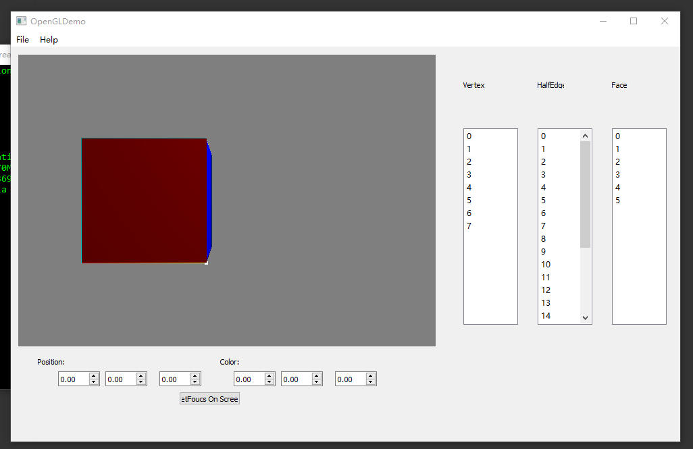
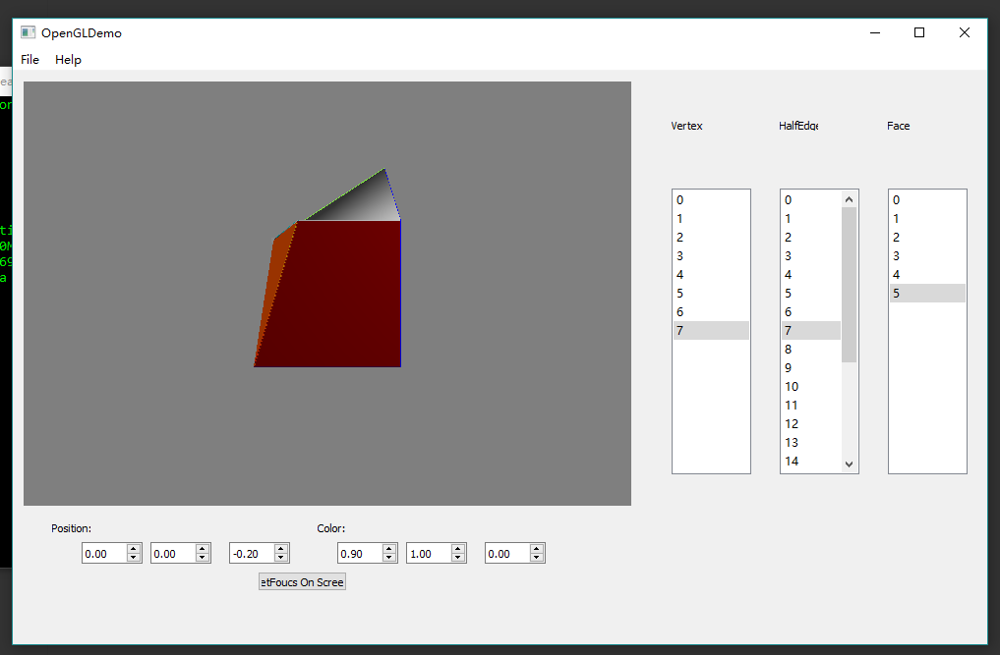
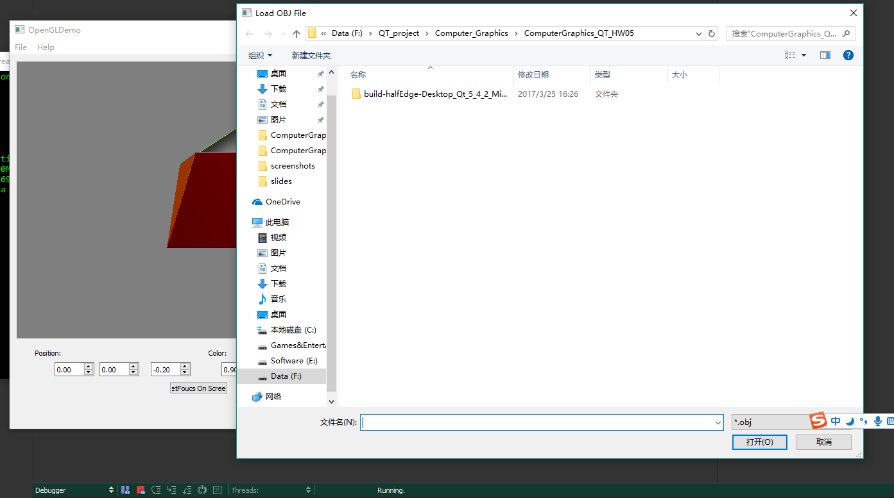
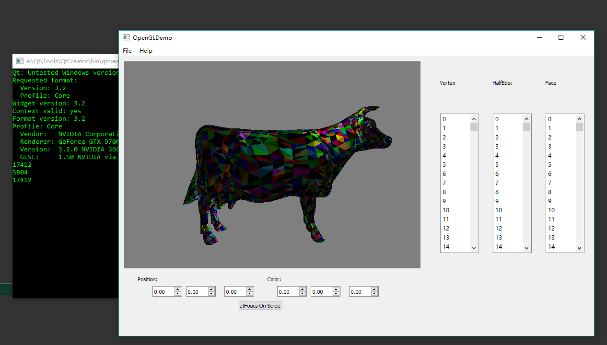

# Computer_Graphics_HW05_Half-Edge Mesh
To build upon knowledge of C++ and OpenGL by creating a half-edge data structure from interlinked pointers and then visualizing mesh using OpenGL vertex buffers.
# Description
* Half-edge mesh construction
* OBJ file conversion to half-edge mesh
* Creating a GUI to display and deform your mesh components
* Using OpenGL to visualize your mesh and the individual mesh components
* Adding variables to your lambert shader to create dynamically changing fragment color

# Screenshots & Results
* **Initialization**

* **Manipulate the point, edge and face(position, color)**

* **Load Obj**

* **Load Obj "Cow"**

